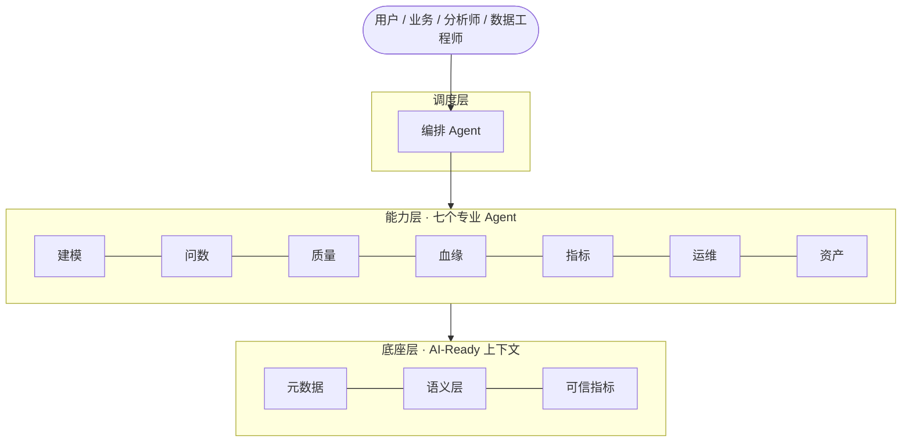

# DataNova

> 探索企业 **Data Agent** 与 **数仓 Agent 化** 的建设过程 —— Exploring how AI Agents reshape enterprise data warehouse construction.

就像 Coding Agent 改写了软件研发方式，DataNova 用来探索 Agent 如何改写企业数据仓库与数据资产的建设方式。

## 📚 文档

| 文档 | 说明 |
|---|---|
| [大数据平台 Agent 化转型方案](docs/agent-transformation-plan.md) | 三层架构 + 七个 Agent + 四步落地（含架构图） |
| [开源数仓 / Data Agent 项目盘点](docs/open-source-data-agents.md) | 开源领域代表性项目梳理 |
| [底座最佳实践：语义层 + 元数据 + 可信指标](docs/best-practices-semantic-metadata-metrics.md) | 数仓 Agent 信任链的建设方法 |
| [Roadmap](ROADMAP.md) | 分阶段建设路线图 |
| [Contributing](CONTRIBUTING.md) | 贡献指南 |

## 🎯 核心理念

- **底座先行**：AI-Ready 的元数据 / 语义层 / 可信指标是一切 Agent 的前提。
- **专业分工**：建模、问数、质量、血缘、指标、运维、资产，各管一段。
- **编排收口**：一个调度 Agent 统一理解意图、编排子 Agent。
- **人审兜底**：Agent 辅助 + 人审核，逐步放权。

## 🏗️ 三层架构



## 📂 目录结构

```
DataNova/
├── docs/          # 方案与调研文档
├── src/           # 探索性实现代码（规划中）
├── ROADMAP.md     # 路线图
├── CONTRIBUTING.md
└── README.md
```

## License

[MIT](LICENSE)
