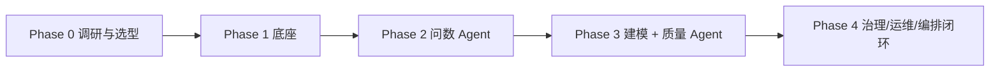

# DataNova Roadmap

> 本路线图描述 DataNova 探索"企业 Data Agent 建设"的阶段规划。遵循核心原则：**底座先行、专业分工、编排收口、人审兜底。**

## 阶段总览

## Phase 0 · 调研与选型（进行中）

- [x] 梳理"大数据平台 Agent 化转型"总体方案（三层架构 + 七个 Agent + 四步落地）
- [x] 盘点开源数仓 / Data Agent 项目
- [x] 整理语义层 / 元数据 / 可信指标最佳实践
- [ ] 选定底层技术栈（语义层 / 元数据 / Agent 框架）
- [ ] 确定首个试点数据域（建议：电商消费者数据域）

## Phase 1 · 底座（AI-Ready 上下文）

- [ ] 搭建主动元数据采集与目录
- [ ] 建立语义层（Metrics as Code，YAML 定义）
- [ ] 对核心指标做认证（GMV / 转化 / 人群口径，确立单一源）

## Phase 2 · 问数 Agent（最快见价值）

- [ ] Text-to-SQL 基础能力
- [ ] 接入语义层，按"指标名"取可信数据
- [ ] 准确率评测框架（SQL 能否跑通 + 数据是否对得上）

## Phase 3 · 建模 + 质量 Agent（提研发效能）

- [ ] 建模 Agent：需求 → 维度建模方案 → 分层 SQL 生成
- [ ] 数据质量 Agent (DQC)：规则自动生成 + 异常根因定位

## Phase 4 · 治理 / 运维 / 编排闭环

- [ ] 元数据 / 血缘 Agent：自动补描述、打标签、补血缘
- [ ] 指标治理 Agent：口径冲突、重复指标检测
- [ ] 运维 / 排障 Agent：调度失败顺血缘定位
- [ ] 资产治理 Agent：僵尸表识别、文档生成
- [ ] 编排 Agent：统一意图理解与子 Agent 调度

## 原则约束

- 全程坚持 **Agent 辅助 + 人审核**，逐步放权。
- 每个 Agent 上线前必须有准确率评测，否则不投入生产。
- 不追求"万能 Agent"，坚持专业分工。
