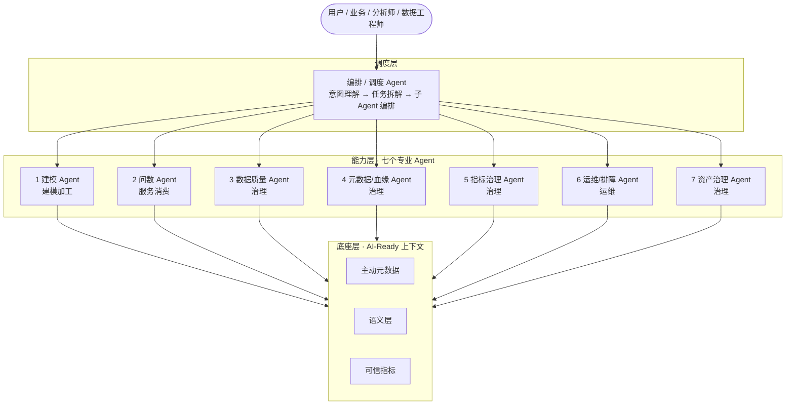
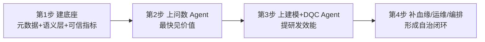

# 大数据平台 Agent 化转型方案：三层架构 + 七个 Agent + 四步落地

> 一句话结论：传统大数据平台转型 Agent 时代，需要的不是一个"万能聊天机器人"，而是
> **「一个底座（AI-Ready 元数据 / 语义层 / 可信指标）+ 一组专业 Agent（建模、问数、质量、血缘、指标、运维、资产）+ 一个编排 Agent」**。
> 落地遵循"底座先行、问数打头阵、建模质量跟进、治理运维收口"，全程坚持 **Agent 辅助 + 人审核**。

---

## 一、核心思路：Agent 对齐平台链路

传统大数据平台的核心链路是：**接入 → 建模加工 → 治理 → 服务消费 → 运维**。Agent 化的正确姿势，是让每一段都有对应的专业 Agent，而不是堆一个大模型聊天框。因此整体设计为三层：

1. **底座层**：所有 Agent 的共同前提（AI-Ready 元数据 + 语义层 + 可信指标）。
2. **能力层**：覆盖链路各环节的专业 Agent。
3. **调度层**：一个编排 Agent，负责理解意图、拆解任务、编排子 Agent。

> ❗ **底座决定上限。** 没有 AI-Ready 的元数据和语义层，上面所有 Agent 都跑不准——这是整个方案能否成立的前提。

---

## 二、整体架构示意图

---

## 三、专业 Agent 清单（按链路分）

### 第 0 层：底座（不是 Agent，但是所有 Agent 的前提）

AI-Ready 的**主动元数据 + 语义层 + 认证过的可信指标**。没有它，下面的 Agent 全部失效，所以放在最前面。

### 第 1 层：覆盖平台链路的七个专业 Agent

| # | Agent | 管哪一段 | 核心职责 |
|---|---|---|---|
| 1 | **建模 Agent** | 建模加工 | 需求 → 维度建模方案 → 分层（ODS/DWD/DWS/ADS）SQL 生成 |
| 2 | **取数 / 问数 Agent** | 服务消费 | Text-to-SQL，按语义层"指标名"取可信数据，面向业务/分析师 |
| 3 | **数据质量 Agent (DQC)** | 治理 | 自动生成/维护质量规则，异常检测与根因定位 |
| 4 | **元数据 / 血缘 Agent** | 治理 | 自动补描述、打标签、补血缘，维护"主动元数据" |
| 5 | **指标治理 Agent** | 治理 | 检测口径冲突、重复指标、命名规范，维护单一源 |
| 6 | **运维 / 排障 Agent** | 运维 | 调度失败时顺血缘定位卡点，给修复建议甚至自动修复 |
| 7 | **资产治理 Agent** | 治理 | 识别僵尸表、重复建设，生成数据字典/文档，优化成本 |

### 第 2 层：编排调度 Agent（总控）

理解用户意图 → 拆解任务 → 调用上面的专业 Agent → 汇总结果。它是"项目经理"，不自己干活，负责协调。

---

## 四、四步落地路径

不要一次全上，按"价值高 + 依赖少"的顺序推进。

| 步骤 | 做什么 | 说明 / 产出 |
|---|---|---|
| **第 1 步** | 建底座（元数据 + 语义层 + 可信指标） | 前提，跳过它后面全白做。产出：Agent 看得懂、算得对的上下文 |
| **第 2 步** | 先上"问数 Agent" | 直接面向业务/分析师，ROI 最直观，最容易拿到支持。依赖第 1 步语义层 |
| **第 3 步** | 再上"建模 Agent + DQC Agent" | 把数据工程师从手写 SQL、手配质量规则里解放出来 |
| **第 4 步** | 补"元数据/血缘 + 运维 + 编排 Agent" | 让平台从"人工治理"走向"自治理"，最后用编排 Agent 串起来 |

---

## 五、四个容易踩的坑

- ⚠️ **别先建"万能 Agent"**：单个大模型啥都干 = 啥都干不好，要专业分工。
- ⚠️ **别跳过底座**：没有 AI-Ready 元数据就上 Agent，等于让它"算错账"。
- ⚠️ **别追求全自治**：数仓责任重，初期一律"Agent 干 + 人审核"，逐步放权。
- ⚠️ **别忽略评测**：每个 Agent 都要有准确率评测（SQL 是否跑通、数据是否对得上），否则不敢用于生产。

---

## 六、结合电商 / 消费者数据域的落地建议

- ✅ **最该先上**：问数 Agent + 指标治理 Agent。电商口径复杂，统一口径 + 业务自助问数，价值最直接、最容易出成果。
- 📌 **底座重点**：指标认证。先把 GMV、转化、人群这些核心指标做成认证过的单一源，再让 Agent 接入。

---

> 🏁 **总结：** 转型不是换一个工具，而是建一套体系——底座先行、专业分工、编排收口、人审兜底。谁先把底座做成 AI-Ready，谁的数仓 Agent 才真正跑得动。
