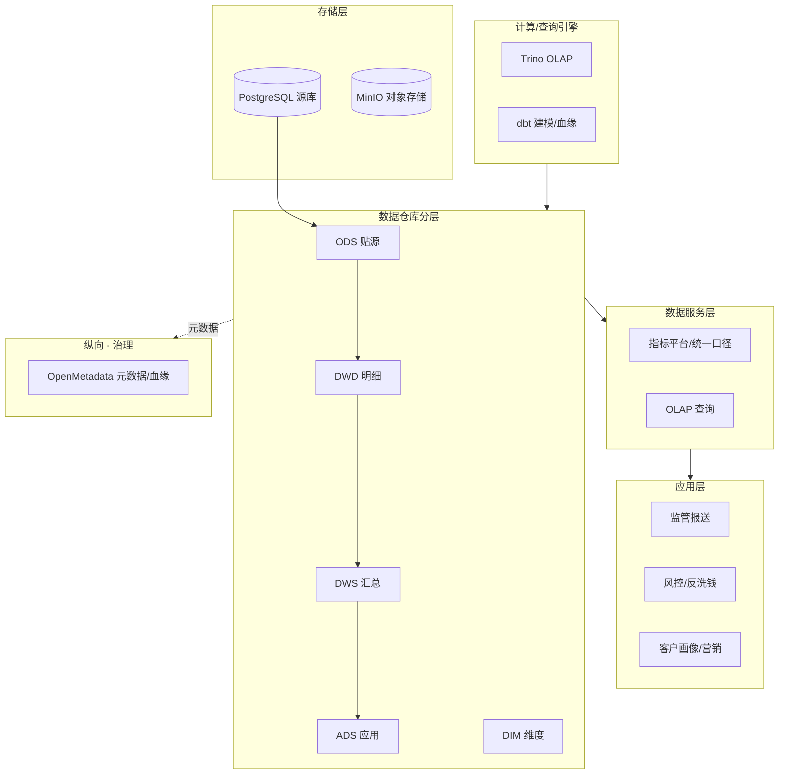

# 银行业模拟数据平台设计文档

> 本文档定义 DataNova 用于探索 Data Agent 的**银行业模拟数据平台**：架构蓝图、主题域、分层模型、表结构、核心指标，以及为检验 Agent 而**故意埋设的"坑"**。
> 底层服务采用 **Docker 容器**部署，单机可复现。

---

## 一、设计目标

1. **业务像真的**：以银行核心业务（客户/账户/交易/风险）为主线，数据间有真实业务关联。
2. **分层像真的**：完整的 ODS → DWD → DWS → ADS + DIM 分层与加工逻辑。
3. **上下文像真的**：表/字段有业务含义、有口径、有血缘；并故意制造脏数据、口径冲突、未脱敏字段，给 Agent 留治理空间。
4. **合规像真的**：体现银行特有的数据分级分类、脱敏、口径可追溯、监管报送等要素。

---

## 二、整体架构



> 纵向治理体系（元数据/血缘/质量/分级）和安全合规体系贯穿所有层，是银行平台的命脉。

---

## 三、技术选型（Docker 部署）

| 组件 | 镜像 | 扮演角色 | 资源 |
|---|---|---|---|
| **PostgreSQL** | `postgres:16` | 模拟核心银行系统源库 (OLTP) | ~256MB |
| **MinIO** | `minio/minio` | 模拟对象存储 / 数据湖（替代 HDFS） | ~256MB |
| **Trino** | `trinodb/trino` | 数仓 OLAP 统一查询引擎 | ~1GB |
| **dbt** | `ghcr.io/dbt-labs/dbt-postgres` | ODS→DWD→DWS→ADS 分层，自动产出血缘/文档/测试 | 按需 |
| **OpenMetadata**（可选） | `openmetadata/server` | 元数据/血缘平台（银行治理核心） | ~2GB |

> 起步建议：先跑 PostgreSQL + Trino + dbt 三件套即可验证全链路；OpenMetadata 在需要测"元数据/血缘 Agent"时再启。

---

## 四、主题域与核心实体

| 主题域 | 核心表 | 说明 |
|---|---|---|
| **客户域** | `cust_info`（客户信息）、`cust_kyc`（KYC） | 含敏感字段（身份证、手机号） |
| **账户域** | `acct_deposit`（存款账户）、`acct_loan`（贷款账户）、`acct_card`（卡账户） | 账户余额、状态 |
| **交易域** | `txn_flow`（交易流水）、`txn_transfer`（转账） | 高频明细，实时性强 |
| **产品域** | `prod_info`（产品信息） | 存款/理财/信贷产品 |
| **风险域** | `risk_overdue`（逾期）、`risk_rating`（风险评级） | 不良、逾期 |
| **维度** | `dim_org`（机构网点）、`dim_date`（日期）、`dim_currency`（币种） | 公共维度 |

---

## 五、数仓分层设计

| 层 | 命名前缀 | 内容 | 示例 |
|---|---|---|---|
| **ODS** | `ods_` | 贴源原始快照（保留脏数据） | `ods_cust_info`, `ods_txn_flow` |
| **DWD** | `dwd_` | 清洗后的明细事实表 | `dwd_txn_detail`, `dwd_acct_balance` |
| **DWS** | `dws_` | 轻度汇总（客户/账户/日粒度） | `dws_cust_asset_d`, `dws_txn_summary_d` |
| **ADS** | `ads_` | 面向应用的指标宽表 | `ads_npl_report`, `ads_cust_profile` |
| **DIM** | `dim_` | 维度表 | `dim_org`, `dim_date` |

---

## 六、核心指标（含口径定义）

| 指标 | 口径 | 主题域 |
|---|---|---|
| **存款余额** | 期末所有存款账户余额之和 | 账户 |
| **贷款余额** | 期末所有贷款账户本金余额之和 | 账户 |
| **不良率 (NPL)** | 不良贷款余额 ÷ 贷款总余额 | 风险 |
| **逾期率** | 逾期贷款余额 ÷ 贷款总余额 | 风险 |
| **AUM** | 客户管理资产总额（存款+理财+…） | 客户 |
| **活跃客户数** | 近 30 天有交易的客户数 ⚠️口径有冲突，见埋坑 | 客户 |
| **交易成功率** | 成功交易笔数 ÷ 总交易笔数 | 交易 |

---

## 七、故意埋设的"坑"（给 Agent 留活干）

> 这是模拟平台的精髓——没有坑，Agent 就没有用武之地。

| # | 坑 | 位置 | 检验哪个 Agent |
|---|---|---|---|
| 1 | **口径冲突**："活跃客户"零售口径(近30天交易) vs 对公口径(近90天) 不一致 | DWS/ADS | 指标治理 Agent |
| 2 | **敏感字段未脱敏**：身份证号、手机号明文 | `ods_cust_info` | 安全合规 / 数据分级 Agent |
| 3 | **不良率口径分散**：NPL 计算逻辑散落多张表，不统一 | 风险域 | 可信指标认证 |
| 4 | **脏数据**：账户余额为负、交易金额异常、KYC 空值 | ODS 层 | 数据质量 (DQC) Agent |
| 5 | **血缘断裂**：某报送报表追不到源头表 | ADS | 元数据/血缘 Agent |
| 6 | **僵尸表**：建几张无人引用的冗余汇总表 | DWS | 资产治理 Agent |
| 7 | **调度失败**：故意写一个会报错的 dbt 模型 | 任意层 | 运维/排障 Agent |

---

## 八、目录结构（sandbox/）

```
sandbox/
├── docker-compose.yml         # PostgreSQL + MinIO + Trino (+ OpenMetadata 可选)
├── README.md                  # 一键启动说明 + 埋坑清单
├── seed/
│   └── generate_bank_data.py  # 银行数据生成脚本（含故意埋坑）
├── dbt/
│   ├── dbt_project.yml
│   ├── models/
│   │   ├── ods/  dwd/  dws/  ads/  dim/
│   └── metrics/
│       └── metrics.yml        # 核心指标口径（含冲突示例）
└── trino/
    └── catalog/               # Trino 连接 PostgreSQL 的 catalog 配置
```

---

## 九、合规要素（银行特色）

- **数据分级分类**：字段标注 C1–C4 敏感级别（如身份证=C4）。
- **脱敏**：敏感字段在 DWD 层做脱敏处理（埋坑 #2 测试 Agent 能否发现 ODS 未脱敏）。
- **口径可追溯**：所有 ADS 指标必须能血缘回溯到 ODS（埋坑 #5 测试）。
- **审计**：保留加工时间、数据版本等操作元数据。
